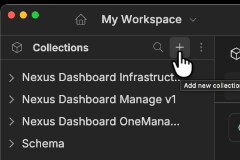
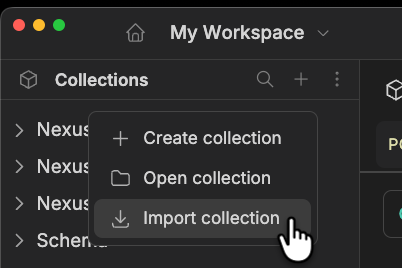
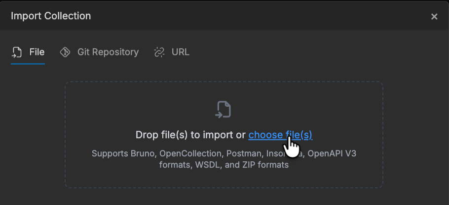
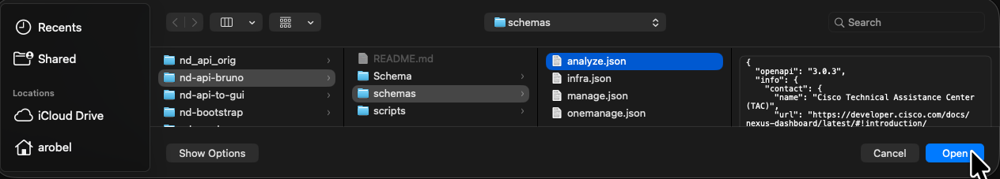

# Cisco Nexus Dashboard API Collections for Bruno

[Bruno](https://www.usebruno.com/) API collections for the **Cisco Nexus Dashboard** REST APIs, generated from the OpenAPI specifications exposed by Nexus Dashboard itself.

## Security Considerations

Let's get this out of the way up front.  Claude is configured (.claude/settings.local.json) with the following:

```json
{
  "permissions": {
    "allow": [
      "Bash(find:*)"
    ]
  }
}
```

Remove this if you do not want Claude to have this level of access.

## Collections

| Collection | Base Path | Endpoints | Description |
|---|---|---|---|
| `Nexus Dashboard Analyze v1` | `/api/v1/analyze` | ~327 | Network analytics: anomalies, advisories, compliance, flows, energy management |
| `Nexus Dashboard Infrastructure v1` | `/api/v1/infra` | ~280 | System management: health, certificates, auth, backups, integrations |
| `Nexus Dashboard Manage v1` | `/api/v1/manage` | ~492 | Fabric/network management: ACI/DCNM fabrics, inventory, policies |
| `Nexus Dashboard OneManage v1` | `/api/v1/oneManage` | ~132 | Unified management: multi-cluster analytics, resource management |
| `Nexus Dashboard Bootstrap` | `/v2/bootstrap` | 8 | Cluster bootstrapping: cluster setup, persona, subnet/service verification |
| `Login` | `/login`, `/api/v1/infra/login` | 2 | Login requests (legacy and current) |
| `Schema` | — | 6 | Logout and OpenAPI schema retrieval for all APIs |

## Prerequisites

- [Bruno](https://www.usebruno.com/) (desktop app or CLI)
- Python 3.10+ (for the conversion script)
- Access to a Cisco Nexus Dashboard instance (ND 4.2+)

## Setup

### 1. Clone the repository

```bash
git clone <repo-url>
cd nd-api-bruno
```

### 2. Open collections in Bruno

To import a Nexus Dashboard schema, do the following.  After importing, we'll run the conversion script to modify it for use with our Bruno Global environment.

#### 2.1 Click the '+' icon in the Collections bar



#### 2.2 Select "Import collection"



#### 2.3 Click the "choose files" link



#### 2.4 Open the file(s)



### 3. Configure the Global environment

In Bruno, create or edit the **Global** environment with the following variables:

| Variable | Value | Description |
|---|---|---|
| `controllerProtocol` | `https://` | Protocol for your ND instance |
| `controllerIp` | `192.168.1.1` | IP or hostname of your ND instance |
| `basePath` | `/api/v1` | Base API path |
| `infraPath` | `{{basePath}}/infra` | Infrastructure API path |
| `managePath` | `{{basePath}}/manage` | Manage API path |
| `oneManagePath` | `{{basePath}}/oneManage` | OneManage API path |
| `analyzePath` | `{{basePath}}/analyze` | Analyze API path |
| `msoPath` | `/mso` | Orchestration API path |
| `nd_username` | `admin` | ND login username |
| `nd_password` | *(your password)* | ND login password |
| `nd_domain` | `local` | ND authentication domain |

## Authentication

1. Open the **Schema** collection
2. Run the **Login** request (`POST /api/v1/infra/login`) or **Login Legacy** request (`POST /login`)
3. The after-response script automatically captures the token into `nd_auth_token`
4. All subsequent requests across all collections include `Authorization: Bearer <token>` via collection-level bearer auth

The token is valid across all API paths regardless of which login endpoint is used.

## Retrieving OpenAPI Schemas

The **Schema** collection includes requests to retrieve the OpenAPI specifications directly from your Nexus Dashboard. After logging in, run any of these:

| Request | Endpoint | Schema |
|---|---|---|
| Infra | `GET {{infraPath}}/openAPISpec` | Infrastructure APIs |
| Manage | `GET {{managePath}}/openAPISpec` | Manage APIs |
| One Manage | `GET {{oneManagePath}}/openAPISpec` | OneManage APIs |
| Analyze | `GET {{analyzePath}}/openAPISpec` | Analyze APIs |
| Orchestration | `GET {{msoPath}}/openAPISpec` | Orchestration/MSO APIs |

Save the JSON response to a file (e.g., `schemas/manage.json`) to use for importing into Bruno.

## Importing a New Collection from an OpenAPI Schema

### 1. Import in Bruno

See sections 2.1 through 2.4 above.

### 2. Run the post-import conversion script

After importing, Bruno uses `{{baseUrl}}` for URLs and sets `oauth2` auth on each request. The conversion script fixes this to match the project's conventions:

```bash
# Auto-detects the path variable from the collection's environment file
python scripts/post_import_convert.py "Nexus Dashboard Manage v1"

# Or specify the path variable explicitly
python scripts/post_import_convert.py "Nexus Dashboard Infrastructure v1" --path-var infraPath
```

The script performs four steps:

1. **URL replacement** — Replaces `{{baseUrl}}` with `{{controllerProtocol}}{{controllerIp}}` (e.g., `{{infraPath}}`)
2. **Environment cleanup** — Removes `basePath`/`baseUrl` from the collection environment file (these are defined in the Global environment)
3. **Collection auth setup** — Adds bearer auth (`{{nd_auth_token}}`) and the before-request script to `opencollection.yml`
4. **Request auth fix** — Replaces per-request `oauth2` auth blocks with `auth: inherit` so requests use the collection-level bearer token

The script is idempotent and safe to run multiple times.

#### 2a. Questions and Answers

Question. Why include a `{{ControllerProtocol}}` variable?  Isn't it always `https://`?

Answer. We wanted the collections in `nd-api-bruno` to support [nd-mock](https://github.com/allenrobel/nd-mock),
which is a FastAPI implementation of a simulated Nexus Dashboard controller's REST API.

Without going through hoops, FastAPI uses `http://` rather than `https://`. Since we use `nd-api-bruno` to develop
[nd-mock](https://github.com/allenrobel/nd-mock), we wanted to be able to switch between environments for mock
(FastAPI) ND controllers versus real ND controllers.

### Path variable mapping

The script auto-detects the path variable from the collection's environment file. If the environment file has already been cleaned, use `--path-var`:

| Path Suffix | Variable | Flag |
|---|---|---|
| `/infra` | `infraPath` | `--path-var infraPath` |
| `/manage` | `managePath` | `--path-var managePath` |
| `/oneManage` | `oneManagePath` | `--path-var oneManagePath` |
| `/analyze` | `analyzePath` | `--path-var analyzePath` |

## Project Structure

``` bash
nd-api-bruno
├── assets
│   └── images
├── CLAUDE.md
├── Login
│   ├── Login Legacy.yml
│   ├── Login.yml
│   └── opencollection.yml
├── Nexus Dashboard Analyze v1
│   ├── AI Infrastructure and Analytics
│   ├── Anomalies and Advisories
│   ├── Compliance Conformance and Update Analysis
│   ├── Dashboards and Explorer
│   ├── Endpoints
│   ├── Energy Management
│   ├── environments
│   ├── Flow Analytics
│   ├── Job and Report Management
│   ├── Network Connectivity Resources
│   ├── opencollection.yml
│   ├── Resources Summary
│   └── Services and Segmentation
├── Nexus Dashboard Bootstrap
│   ├── Bootstrap Cluster Node 2.yml
│   ├── Bootstrap Cluster.yml
│   ├── Cluster syscfg.yml
│   ├── Cluster.yml
│   ├── opencollection.yml
│   ├── Persona.yml
│   ├── Verify Cluster Subnets.yml
│   ├── Verify External Service.yml
│   └── VerifyRemoteServices.yml
├── Nexus Dashboard Infrastructure v1
│   ├── Authentication
│   ├── Backup and Restore
│   ├── Certificate Management
│   ├── environments
│   ├── History and Logs
│   ├── Integrations
│   ├── License Management
│   ├── Multi Tenancy
│   ├── Multi-Cluster Connectivity
│   ├── opencollection.yml
│   ├── System Bootstrap
│   ├── System Settings
│   ├── System Software
│   ├── System Status
│   ├── Tech Support
│   └── Users and Security
├── Nexus Dashboard Manage v1
│   ├── Access-ToR Associations
│   ├── AI Infrastructure and Analytics
│   ├── Anomaly Settings
│   ├── Change Control
│   ├── Configuration Compliance
│   ├── Configuration Deployment
│   ├── Device Credentials
│   ├── Endpoints
│   ├── environments
│   ├── Fabric Management
│   ├── Fabric Software Management
│   ├── Flows
│   ├── Interfaces
│   ├── Inventory
│   ├── L4L7 Services
│   ├── Links
│   ├── Multi Tenancy
│   ├── opencollection.yml
│   ├── Policies
│   ├── Resource Management
│   ├── Routing Policies
│   ├── Security and Segmentation
│   ├── Template Library
│   └── VRFs and Networks
├── Nexus Dashboard OneManage v1
│   ├── Advisories and Anomalies
│   ├── APIC API Proxy
│   ├── environments
│   ├── Fabric Management
│   ├── History and Logs
│   ├── Inventory
│   ├── Links
│   ├── Multi-Cluster Analytics
│   ├── opencollection.yml
│   ├── Resource Management
│   ├── Security and Segmentation
│   └── VRFs and Networks
├── pyproject.toml
├── README.md
├── Schema
│   ├── Analyze.yml
│   ├── environments
│   ├── Infra.yml
│   ├── Logout.yml
│   ├── Manage.yml
│   ├── One Manage.yml
│   ├── opencollection.yml
│   └── Orchestration.yml
├── schemas
│   ├── 4.2.1.10
│   └── 4.2.1.4
├── scripts
│   ├── fix_openapi_refs.py
│   ├── fix_openapi_tags.py
│   └── post_import_convert.py
└── uv.lock
```

Each collection contains:
- `opencollection.yml` — Collection config with bearer auth and before-request script
- `environments/*.yml` — Collection-specific environment variables
- `<Category>/*.yml` — Request files grouped by API category
